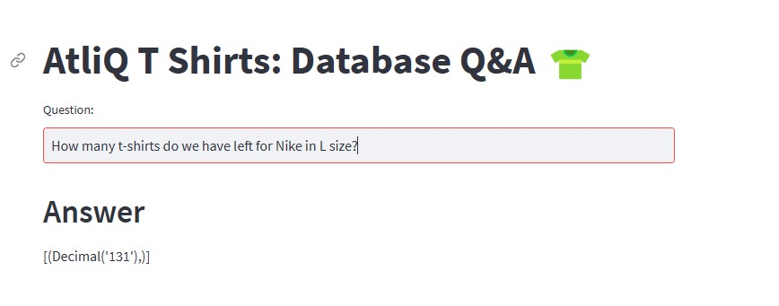

# Data-Query-Application-with-Natural-Language

This is an application built with Streamlit and LangChain that allows users to query a database using natural language. The application converts user questions into SQL queries and displays the corresponding results.

## Key Features

- **Natural Language to SQL Conversion:**
  - Utilizes a language model to transform user questions into SQL queries.
  - Supports complex queries with multiple conditions and operations.

- **Query Execution and Result Display:**
  - Connects to a database and executes the generated SQL queries.
  - Presents query results visually on the Streamlit interface.

- **Customization and Scalability:**
  - Easily customizable and extensible to suit specific databases and requirements.

## Installation

1. **Cloning repository:**

   ```bash
   git clone https://github.com/pntrungbk15/All_Demo.git
   cd All_Demo/app_2
   ```

2. **Create and Activate a Virtual Environment:**

   ```bash
   python -m venv venv
   source venv/bin/activate  # Trên macOS/Linux
   venv\Scripts\activate     # Trên Windows
   ```

3. **Install Required Libraries:**

   ```bash
   pip install -r requirements.txt
   ```

4. **Configure Environment Variables:**

   Create a `.env` file in the `app_2` directory and add the necessary configuration details, for example:

   ```env
   OPENAI_API_KEY=your_openai_api_key
   DATABASE_URL=your_database_url
   ```

## Usage

1. **Run the Streamlit Application:**

   ```bash
   streamlit run main.py
   ```

2. **Interact with the Application:**
   - Enter a question in natural language into the input field.
   - The application will display the corresponding SQL query and the query results from the database.

## Directory Structure

- `main.py`: The main file that runs the Streamlit application, handling the user interface and interactions.
- `langchain_help.py`: Contains helper functions related to LangChain, including generating SQL queries from natural language and executing them.
- `few_shots.py`: Provides few-shot examples to improve the model’s accuracy in converting natural language to SQL.

## UI Screenshots

